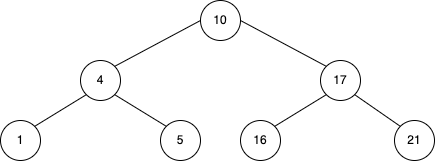
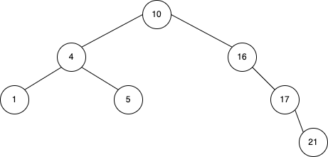
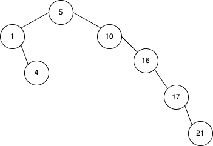
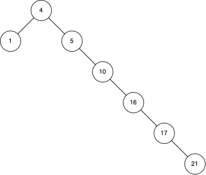
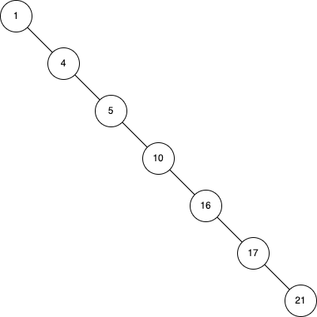
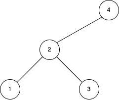

# 12 章 練習問題

## 12.1-1

> キーの集合 $\lbrace 1,4,5,10,16,17,21 \rbrace$ を格納する高さ $2,3,4,5,6$ の $2$ 分探索木を描け。

### 高さ $2$



### 高さ $3$



### 高さ $4$



### 高さ $5$



### 高さ $6$



## 12.1-2

> $2$ 分探索木条件と $min$ ヒープ条件（第 $6.1$ 節を参照）の違いを述べよ。 $min$ ヒープ条件を利用して、 $n$ 個の節点を持つ木に格納されているキーをソートされた順で $O(n)$ 時間で印刷することができるか？できると思うときにはその方法を、できないと思うときにはなぜできないかを説明せよ。

$2$ 分探索木条件は左右の関係、 $min$ ヒープ条件は上下の関係。  
ソート順での印刷に関してはできない。次の要素がどこにあるかがわからないので、巡回する道が重複してしまう。

## 12.1-3

> 中間順木巡回を実現する非再帰的なアルゴリズムを記述せよ。（**ヒント:** スタックを補助データ構造として用いる簡単な解がある。より複雑であるが洗練された解では、スタックを用いず、その代わりに $2$ つのポインタの等価性判定が可能であると仮定する。）

```pseudo
INORDER-TREE-WALK(x):
  S を スタックとする
  V を 配列とする
  PUSH(S, x)
  if not EMPTY(S)
    x = POP(S)
    if x == NIL
      continue
    if V が x を含む
      x.key を印刷する
      continue
    V に x を追加する
    PUSH(S, x.right)
    PUSH(S, x)
    PUSH(S, x.left)
```

## 12.1-4

> $n$ 個の節点を持つ木を $\Theta(n)$ 時間で先行順及び後行順で巡回する再帰的アルゴリズムを設計せよ。

```pseudo
PREORDER-TREE-WALK(x):
  if x ≠ NIL
    x.key を印刷する
    PREORDER-TREE-WALK(x.left)
    PREORDER-TREE-WALK(x.right)
```

```pseudo
POSTORDER-TREE-WALK(x):
  if x ≠ NIL
    POSTORDER-TREE-WALK(x.left)
    POSTORDER-TREE-WALK(x.right)
    x.key を印刷する
```

## 12.1-5

> 比較演算モデルでは $n$ 個の要素をソートするのに最悪の場合には $\Omega(n\lg n)$ 時間かかることから、比較演算だけを用いて $n$ 個の要素を持つ任意のリストから $2$ 分探索木を構成するどのアルゴリズムも、最悪の場合には実行に $\Omega(n\lg n)$ 時間かかることを説明せよ。

？

## 12.2-1

> $1$ と $1000$ の間の自然数の集合が $2$ 分探索木に格納されており、数 $363$ を探索しようとしている。以下に示す列の中で探索に現れる可能性の**ない**節点の列はどれか？
>
> a. $2,252,401,398,330,344,397,363$  
> b. $924,220,911,244,898,258,362,363$  
> c. $925,202,911,240,912,245,363$  
> d. $2,399,387,219,266,382,381,278,363$  
> e. $935,278,347,621,299,392,358,363$

c: $911,240,912$ はあり得ない  
e: $347,621,299$ はあり得ない

## 12.2-2

> 手続き $\text{TREE-MINIMUM}$ と $\text{TREE-MAXIMUM}$ の再帰版を書け。

```pseudo
TREE-MINIMUM(x):
  if x.left == NIL
    return x
  else
    return TREE-MINIMUM(x.left)
```

```pseudo
TREE-MAXIMUM(x):
  if x.right == NIL
    return x
  else
    return TREE-MINIMUM(x.right)
```

## 12.2-3

> 手続き $\text{TREE-PREDECESSOR}$ を書け。

```pseudo
TREE-PREDECESSOR(x):
  if x.left ≠ NIL
    return TREE-MAXIMUM(x.left)
  y = x.p
  while y ≠ NIL かつ x == y.left
    x = y
    y = y.p
  return y
```

## 12.2-4

> 悠木教授は注目に値する $2$ 分探索木の性質を発見したと考えている。 $2$ 分探索木からキー $k$ を探索する手続きがある葉で終了したと仮定する。 $3$ つの集合 $A,B,C$ を考える。 $A$ は探索道の左に現れるキーの集合、 $B$ は探索道上に現れるキーの集合、 $C$ は探索道の右に現れるキーの集合である。悠木教授は任意の $3$ つのキー $a \in A, b \in B, c \in C$ について、 $a \le b \le c$ が成立すると主張している。教授の主張に対する最小の反例を与えよ。



$k = 1$  
$A = \lbrace \rbrace$  
$B = \lbrace 4,2,1 \rbrace$  
$C = \lbrace 3 \rbrace$

$4 \in B > 3 \in C$

## 12.2-5

> $2$ 分探索木の節点が子を $2$ つ持つなら、その次節点は左の子を持たず、その先行節点は右の子を持たないことを示せ。

2 つの子をもつ節点を $x$, $x$ の次節点を $s$, $x$ の先行節点を $p$ とする。  
$s$ が左の子 $c$ を持つとすると、 $x \le c \le s$ となり、 $s$ が $x$ の次節点であることに矛盾する。  
$p$ が右の子 $d$ を持つとすると、 $p \le d \le x$ となり、 $p$ が $x$ の先行節点であることに矛盾する。

## 12.2-6

> 相異なるキーを格納する $2$ 分探索木 $T$ を考える。 $T$ のある節点 $x$ は右部分木を持たず、しかも次節点 $y$ を持つと仮定する。 $y$ は、 $x$ の祖先でその左の子もまた $x$ の祖先であるものの中で最も木の下にある節点であることを示せ。（どの節点も自分自身の祖先であることを思い出せ。）

スキップ

## 12.2-7

> $n$ 個の節点を持つ $2$ 分探索木の中間順巡回を実現する別の方法は、まず $\text{TREE-MINIMUM}$ を用いて木の中から最小の要素を発見し、続いて $n-1$ 回 $\text{TREE-SUCCESSOR}$ を呼び出すことである。このアルゴリズムが $\Theta(n)$ 時間で走ることを示せ。

スキップ

## 12.2-8

> 高さ $h$ の $2$ 分探索木のどの節点から実行を開始しても、連続する $k$ 回の $\text{TREE-SUCCESSOR}$ の呼出しは $O(k+h)$ 時間で実行できることを示せ。

スキップ

## 12.2-9

> $T$ を相異なるキーを格納する $2$ 分探索木とする。任意の葉を $x$, $y$ をその親とする。 $y.key$ は $x.key$ より大きい $T$ のキーの中で最も小さいか、 $x.key$ より小さいキーの中で最も大きいことを証明せよ。

スキップ
